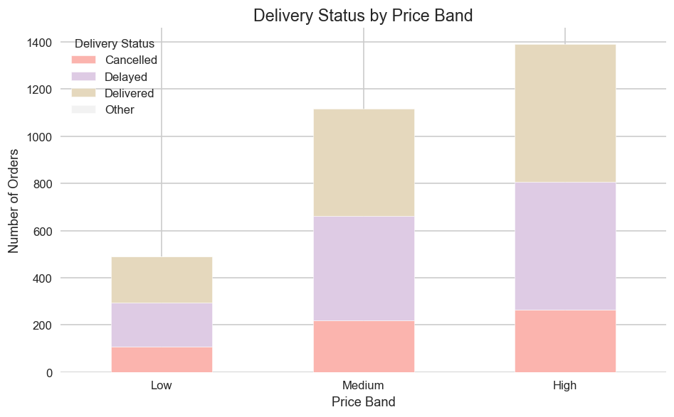

# 📊 Sales & Customer Behaviour Insights — _Green Cart Ltd. Q2 Analysis_


---

## 📊 Results Dashboard Preview

<p align="center">
  
  
  
</p>

> Snapshot of weekly revenue trends, top product categories, and delivery performance.

---

## 🎯 Project Goal

Analyze **Green Cart Ltd. Q2 sales and customer datasets** to uncover insights on revenue, product performance, customer behaviour, and delivery efficiency. The analysis informs marketing, operational strategies, and targeted promotions.

---

## 🧠 Overview

This project transforms raw sales, product, and customer data into actionable business insights through **data cleaning**, **feature engineering**, **exploratory data analysis (EDA)**, and **visualization**.

**Core Objectives**

- Clean and merge sales, product, and customer data
- Generate new features for deeper insights
- Analyze revenue patterns, product category performance, and customer loyalty
- Evaluate delivery reliability
- Provide actionable business recommendations

---

## 🧩 Dataset

Three datasets were used:

1. **Sales Dataset** — Transactions for Q2  
   Columns: `order_id`, `customer_id`, `product_id`, `quantity`, `unit_price`, `order_date`, `payment_method`, `region`, `discount_applied`, `delivery_status`

2. **Product Dataset** — Product metadata  
   Columns: `product_id`, `product_name`, `category`, `launch_date`, `base_price`, `supplier_code`

3. **Customer Dataset** — Customer information  
   Columns: `customer_id`, `email`, `signup_date`, `gender`, `region`, `loyalty_tier`

---

## 🧹 Data Cleaning Summary

| Step                     | Description                                                                         |
| ------------------------ | ----------------------------------------------------------------------------------- |
| **Text Standardisation** | Cleaned `delivery_status`, `loyalty_tier`, `region`, `payment_method`               |
| **Missing Values**       | Filled missing `discount_applied`, `quantity`, `email`, `product_id`, `customer_id` |
| **Date Parsing**         | Converted `order_date`, `launch_date`, `signup_date` to datetime                    |
| **Duplicates**           | Flagged and resolved duplicate orders and customer records                          |
| **Numeric Validation**   | Verified `quantity`, `unit_price`, `discount_applied` as numeric and non-negative   |

✅ **Result:** All datasets are standardized, merged, and ready for analysis.

---

## 🧩 Feature Engineering Summary

| Feature         | Description                                                          |
| --------------- | -------------------------------------------------------------------- |
| `revenue`       | Actual order value after discount; key metric for sales analysis     |
| `order_week`    | ISO week from `order_date` to track weekly trends                    |
| `price_band`    | Categorizes `unit_price` as Low (<£15), Medium (£15–30), High (>£30) |
| `days_to_order` | Days between product launch and order; measures adoption speed       |
| `email_domain`  | Extracted from customer email; useful for segmentation               |
| `is_late`       | Boolean flag for delayed deliveries; evaluates logistic performance  |

---

## 📈 Key Findings & Trends

### 🔹 Weekly Revenue Trends

- North and South regions show consistent revenue, with West peaking later in Q2.
- Revenue sharply increases around Week 19, peaking Weeks 23–31.

### 🔹 Top Product Categories

- **Cleaning**: £93,754 — highest revenue
- **Storage**: £47,081
- **Outdoors**: £40,220
- Dominance of Cleaning category suggests strong customer preference.

### 🔹 Customer Behaviour

- **Gold tier** customers generate the highest number of orders.
- Signup timing affects revenue: early signups contribute more.

### 🔹 Delivery Performance

- Delays concentrated in **Medium** and **High-Price Band** orders.
- East region shows the highest percentage of late deliveries.

### 🔹 Correlation Analysis

- Quantity and revenue strongly correlated (0.72)
- Discount has negligible effect on quantity (-0.007)
- Discounts slightly negatively correlated with revenue (-0.12)

---

## 🧭 Business Insights

| Focus Area            | Key Insight                                       | Business Implication                                    |
| --------------------- | ------------------------------------------------- | ------------------------------------------------------- |
| **Discount Strategy** | No correlation with higher quantities             | Focus on value-add promotions instead of deep discounts |
| **Customer Loyalty**  | Gold tier generates highest revenue               | Target Gold tier with exclusive offers and early access |
| **Delivery**          | Medium/High price orders delayed, especially East | Introduce premium shipping or review logistics partners |

---

## 🧰 Tools & Libraries

- 🐍 **Python 3.10+**
- 📊 **Pandas, NumPy**
- 🎨 **Matplotlib, Seaborn**
- 📓 **Jupyter Notebook**
- ⚙️ **scikit-learn** (MinMaxScaler for optional feature normalization)

---

## 📁 Project Structure

```
sales_customer_insights/
├── data/
│ ├── sales_data.csv
│ ├── product_info.csv
│ └── customer_info.csv
├── notebooks/
│ └── analysis.ipynb
├── reports/
│ └── Zahra_Hayati_Wk2_Sales_Behaviour_Report.pdf
├── visuals/
│ ├── weekly_revenue_trends.png
│ ├── top_categories.png
│ ├── quantity_boxplot.png
│ ├── correlation_heatmap.png
│ ├── loyalty_orders.png
│ ├── revenue_signup_month_loyalty.png
│ ├── normalized _distribution.png
│ └── delivery_status_price_band.png
└── README.md
```

---

## 🧾 Deliverables

- 📘 **Notebook:** `analysis.ipynb` — Cleaned dataset, feature engineering, EDA, visualizations, and markdown explanations
- 📝 **PDF Report:** Summary of insights, charts, business questions answered, recommendations
- 🖼️ **Visuals:** Exported charts under `visuals/`

---

## 🧩 Recommendations

1. **Revise Discount Strategy & Focus on Gold Tier**

   - Use value-add bundling instead of deep discounts
   - Target Gold tier with exclusive promotions

2. **Address High-Value Delivery Bottlenecks**
   - Investigate logistics in East region
   - Introduce premium shipping for High-Price Band orders

---

## ⚠️ Data Risks

- **Duplicate / Conflicting Orders:** Some `order_id`s linked to multiple customers, affecting revenue attribution
- **Category Inconsistencies:** `region`, `delivery_status`, `loyalty_tier` required standardization
- **Missing Customer Data:** Some fields like `signup_date` and `loyalty_tier` inferred, which may bias segmentation

---

## 🧠 Learnings

- Hands-on experience with cleaning complex, multi-source datasets
- Feature engineering to derive actionable business metrics
- Data visualization to communicate insights effectively to stakeholders
- Analysis of customer behaviour, revenue trends, and delivery performance

---

## 📬 Contact

**👩‍💻 Author:** Zahra Hayati  
**📘 Project:** Week 2 — _Sales & Customer Behaviour Insights_  
**📧 Email:** zahrahyt.7@gmail.com  
**🔗 LinkedIn:** [linkedin.com/in/zahra-hayati-data-science](https://www.linkedin.com/in/zahra-hayati-data-science)  
**🐙 GitHub:** [github.com/zahra-hayati](https://github.com/zahra-hayati)
